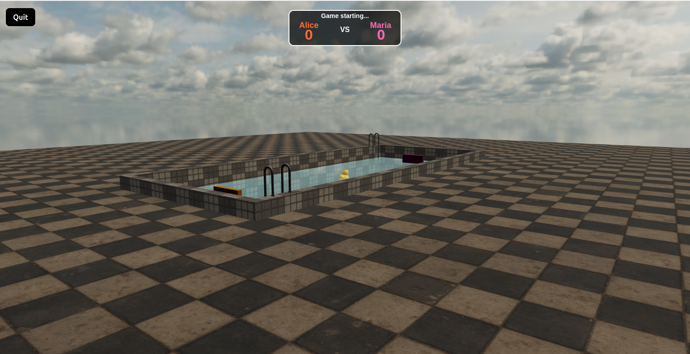
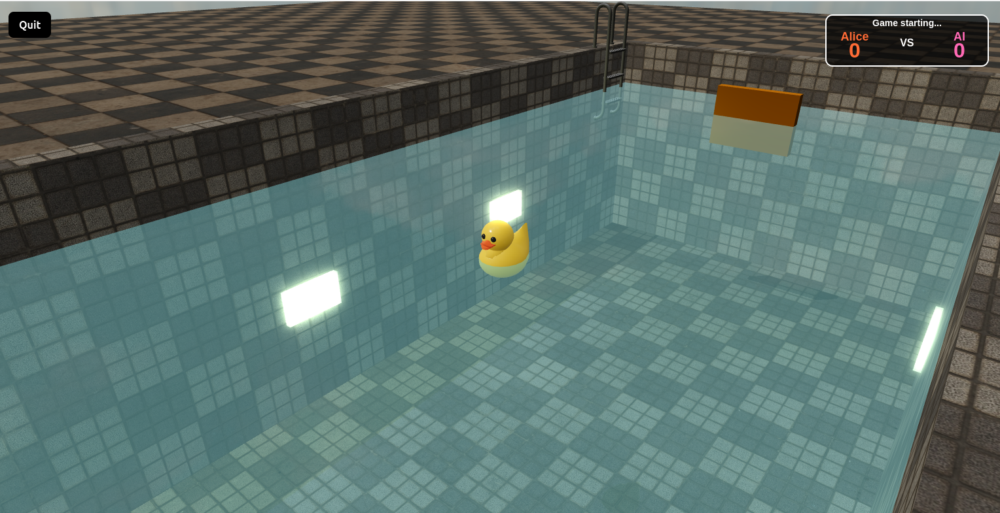

# Transcendence

> The final project for the 42 core curriculum. A robust, full-stack online Pong platform featuring real-time multiplayer gameplay, advanced 3D graphics, and a secure, scalable architecture.

## 📖 Overview

**Transcendence** is a Single Page Application (SPA) that reimagines the classic Pong game with modern web technologies. Built with a **Fastify** backend and a **TypeScript/Vite** frontend, it leverages **Babylon.js** for immersive 3D graphics and **WebSockets** for responsive server-side game logic.

The project emphasizes security, performance, and user experience, integrating features like Two-Factor Authentication (2FA), an AI opponent, and a dynamic tournament system.

<p align="center">
  
  &nbsp; &nbsp;
  
</p>

---

## ✨ Key Features

### 🎮 Gameplay & Experience
*   **Server-Side Pong:** Game logic (physics, scoring, ball movement) is calculated on the server to prevent cheating and ensure consistency.
*   **3D Graphics:** Powered by **Babylon.js**, offering a visually engaging experience while maintaining the essence of the original 1972 game.
*   **Game Modes:**
    *   **Classic 1v1:** Local or Remote multiplayer.
    *   **AI Opponent:** An intelligent AI that simulates human behavior and reaction times (no A* algorithms).
    *   **Tournament System:** Organize matchmaking, and track progress through a bracket system.
*   **Matchmaking:** Automated system to pair players and announce upcoming matches.

### 👤 User Management
*   **Authentication:** Secure login/registration with **JWT** (JSON Web Tokens).
*   **Security:** **Two-Factor Authentication (2FA)** support via Google Authenticator/QR codes.
*   **Social:** Friend system (add/remove, view online status).
*   **Profiles:** Customizable avatars, display names, and comprehensive match history/stats (wins, losses, rank).

### 🛡️ Security & Architecture
*   **Secure Connections:** Full HTTPS and WSS (Secure WebSockets) implementation.
*   **Data Protection:** Strong password hashing (Bcrypt), SQL injection protection, and XSS mitigation.
*   **Validation:** Strict server-side validation for all user inputs.
*   **Containerization:** Fully Dockerized environment for consistent deployment.

---

## 🛠️ Tech Stack

| Component | Technology |
|-----------|------------|
| **Frontend** | TypeScript, Vite, TailwindCSS |
| **Graphics** | Babylon.js |
| **Backend** | Node.js, Fastify |
| **Database** | SQLite (via Better-SQLite3) |
| **Real-time** | WebSockets (@fastify/websocket) |
| **Security** | JWT, Speakeasy (2FA), Helmet |
| **DevOps** | Docker, Docker Compose, Make |

---

## 🚀 Getting Started

### Prerequisites
*   **Docker** & **Docker Compose**
*   **Make** (optional, for convenience)
*   **Node.js v16+** (only for local development without Docker)

### Quick Start (Docker)

The easiest way to run the application is using the provided Makefile and Docker setup.

1.  **Clone the repository:**
    ```bash
    git clone <repository-url>
    cd transcendence
    ```

2.  **Configure Environment:**
    Create a `.env` file in the project root with the following secrets:
    ```ini
    JWT_SECRET=your_secure_jwt_secret
    COOKIE_SECRET=your_secure_cookie_secret
    ```

3.  **Launch the application:**
    ```bash
    make up
    ```
    *This command will automatically generate self-signed SSL certificates, build the Docker images, and start the services.*

4.  **Access the App:**
    Open your browser and navigate to:
    ```
    https://localhost:8443
    ```
    *(Note: Accept the self-signed certificate warning in your browser)*

5.  **Stop the application:**
    ```bash
    make down
    ```

### Available Make Commands

The project includes a `Makefile` to simplify common tasks:

| Command | Description |
|---------|-------------|
| `make up` | Generates certificates, builds images, and starts services in the background. |
| `make down` | Stops and removes containers, networks, and volumes. |
| `make build` | Rebuilds the Docker images without starting them. |
| `make logs` | Follows the logs of all running services. |
| `make exec` | Opens a shell inside the running application container. |
| `make clean` | Removes locally built Docker images. |

### Manual Development Setup

If you prefer to run the services locally without Docker for development purposes:

1.  **Configure Environment:**
    Create a `.env` file in the project root:
    ```ini
    JWT_SECRET=your_secure_jwt_secret
    COOKIE_SECRET=your_secure_cookie_secret
    ```

2.  **Generate Certificates:**
    ```bash
    mkdir -p server/.env
    cd server/.env && openssl req -x509 -newkey rsa:2048 -keyout key.pem -out cert.pem -days 365 -nodes -subj "/CN=localhost"
    cd ../..
    ```

3.  **Backend Setup:**
    *   Ensure Redis is running locally (required for session management).
    *   Install and run:
        ```bash
        cd backend
        npm install
        npm run dev
        ```

3.  **Frontend Setup:**
    *   Install and run:
        ```bash
        cd frontend
        npm install
        npm run dev
        ```

---

## 📂 Project Structure

```
transcendence/
├── server/             # Monorepo-style server directory
│   ├── backend/        # Fastify server, API, and Game Logic
│   │   ├── src/        # Source code (Controllers, Models, Routes, Game Engine)
│   │   └── public/     # Static assets
│   ├── frontend/       # Vite + TypeScript Client
│   │   ├── src/        # Components, Babylon.js scenes, UI logic
│   │   └── assets/     # Images, textures, models
│   └── shared/         # Shared types and utilities
├── database/           # SQLite database file location
├── docker-compose.yml  # Container orchestration
├── Makefile            # Command shortcuts
└── README.md           # Project documentation
```

## 👥 Authors

*   [**chilituna**](https://github.com/chilituna) - *Frontend Gameplay & 3D Graphics*


## 📄 License

This project is licensed under the MIT License - see below for details.

```
Permission is hereby granted, free of charge, to any person obtaining a copy
of this software and associated documentation files (the "Software"), to deal
in the Software without restriction, including without limitation the rights
to use, copy, modify, merge, publish, distribute, sublicense, and/or sell
copies of the Software, and to permit persons to whom the Software is
furnished to do so, subject to the following conditions:

The above copyright notice and this permission notice shall be included in all
copies or substantial portions of the Software.

THE SOFTWARE IS PROVIDED "AS IS", WITHOUT WARRANTY OF ANY KIND, EXPRESS OR
IMPLIED, INCLUDING BUT NOT LIMITED TO THE WARRANTIES OF MERCHANTABILITY,
FITNESS FOR A PARTICULAR PURPOSE AND NONINFRINGEMENT. IN NO EVENT SHALL THE
AUTHORS OR COPYRIGHT HOLDERS BE LIABLE FOR ANY CLAIM, DAMAGES OR OTHER
LIABILITY, WHETHER IN AN ACTION OF CONTRACT, TORT OR OTHERWISE, ARISING FROM,
OUT OF OR IN CONNECTION WITH THE SOFTWARE OR THE USE OR OTHER DEALINGS IN THE
SOFTWARE.
```


